# LEMP STACK IMPLEMENTATION DOCUMENTATION
## First we set up a LEMP STACK using EC2
## We start by creating an account on AWS.

1. Start by creating an instance (virtual machine) by selecting “ubuntu server 20.04 LTS” from Amazon Machine Image(AMI)(free tier).
2. Then select “t2.micro”, go to the security group and select “an existing security group” review and launch instance.

### This launches the instance and takes you to the Instances dashboard

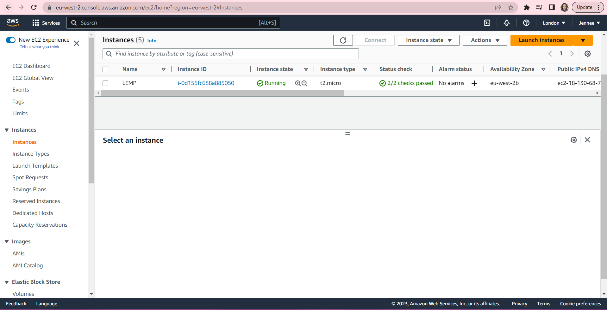

3. Then open a terminal on your system and enter the folder where your previously downloaded PEM file is located.

### In this case we use the Git Bash Terminal
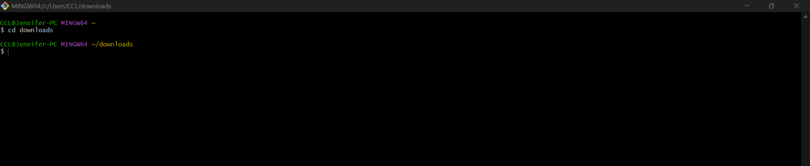

4. Connect to the instance from ubuntu terminal using this command:
>`ssh -i "Jennee-EC2.pem" ubuntu@ec2-18-130-68-79.eu-west-2.compute.amazonaws.com`

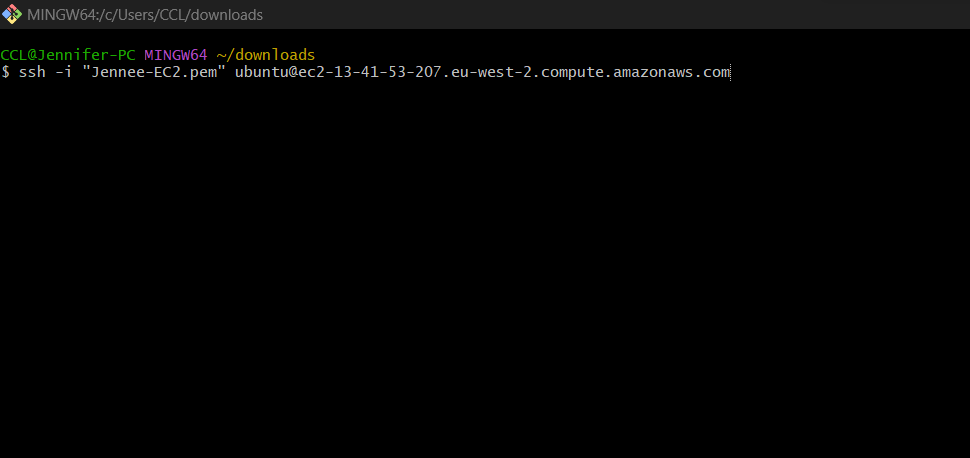

### This automatically connects to the instance when you click Enter
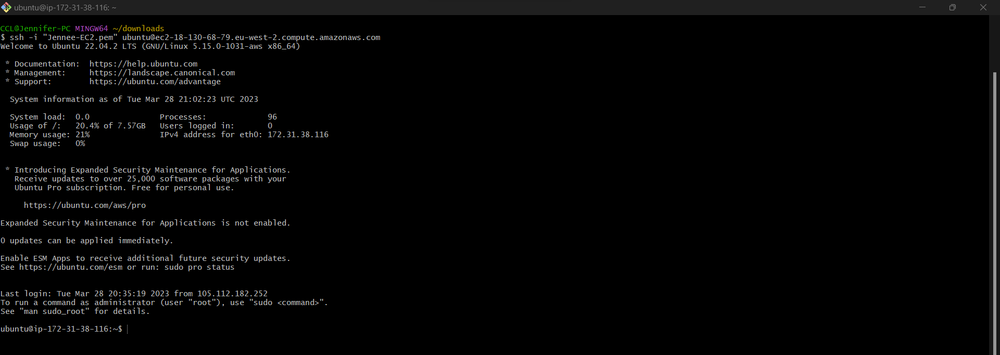

## INSTALLING THE NGINX WEB SERVER 
### Install the Nginx Web Server to display web pages to site visitors.

### We first update the server's package, before we download the nginx web server, using this command:
>`sudo apt update`

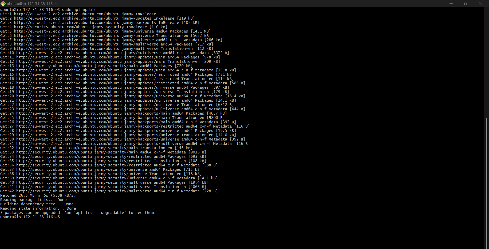

### Then install Nginx with this command:
>`sudo apt install nginx`
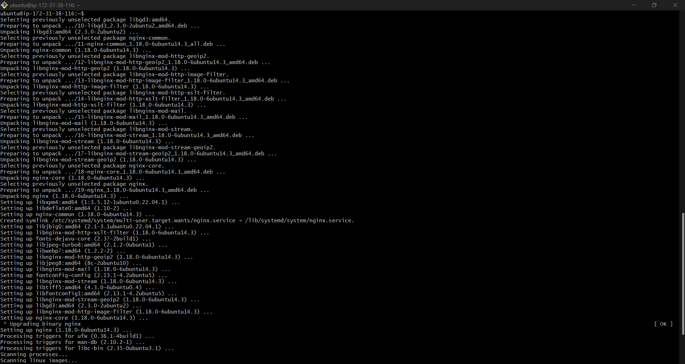

### Verify that nginx was successfully installed and is running as a service in Ubuntu, using this command:
>`sudo systemctl status nginx`

### If it's green and says "active (running)", then it was successfully installed. Like so:
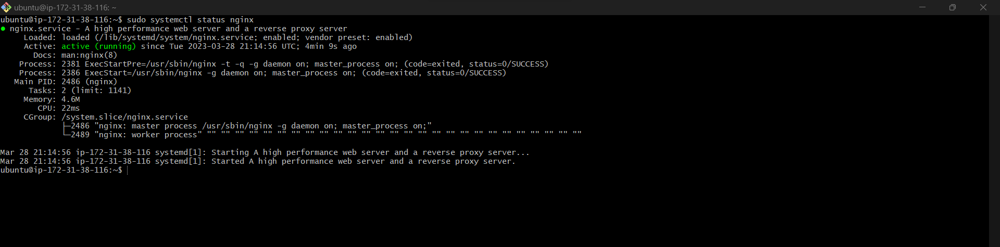

### Test how our Nginx server can respond to requests from the Internet.
### Open a web browser of your choice and try to access following url:
>`http://<Public-IP-Address>:80`

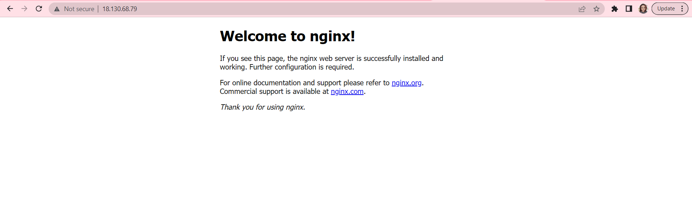

---
---
## INSTALLING MYSQL
### We will install a DBMS to be able to store and manage data for the site in a relational database.
### Install MySQL using this command:
>` sudo apt install mysql-server`
#### Type Y and click Enter to continue the download
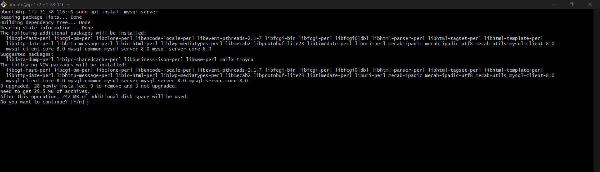

### When the installation is complete, log in to the MySQL console using this command:
>` sudo mysql`

### This will connect to the MySQL server as the administrative database user root

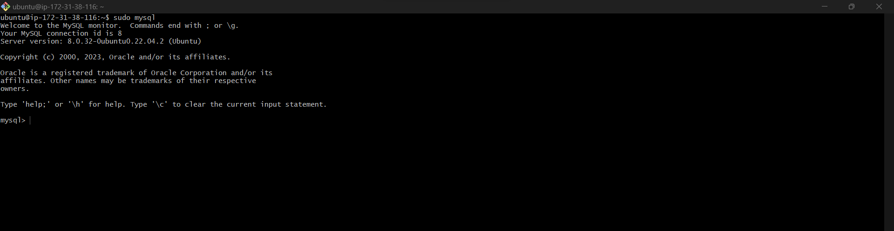

### Set default password as "PassWord.1" for root user, using this command:
>` ALTER USER 'root'@'localhost' IDENTIFIED WITH mysql_native_password BY 'PassWord.1';`

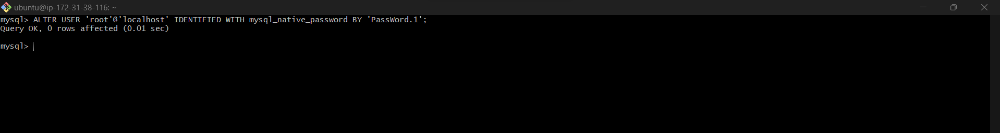

### Then exit the MySQL shell with this command:
>` mysql> exit`
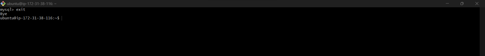

### Then run this command to start the interactive script:
>` sudo mysql_secure_installation`
### Set secure root password
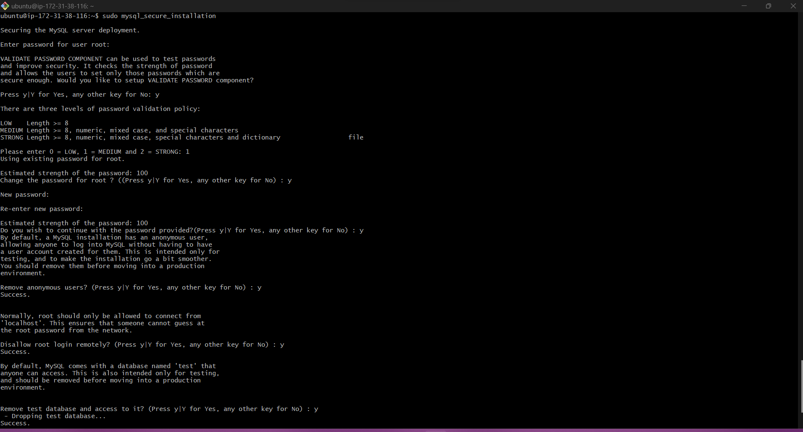
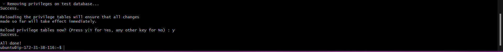

### Then test if you’re able to log in to the MySQL console using this command:
>`sudo mysql -p`
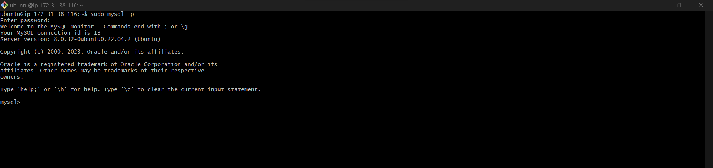

### Then exit with this command:
>` mysql> exit`

## STEP 3 – INSTALLING PHP

### Install php-fpm and php-mysql using this command:
>` sudo apt install php-fpm php-mysql`
#### Type Y and click Enter to continue with the installation

## CONFIGURING NGINX TO USE PHP PROCESSOR

### We can create server blocks on the Nginx web server, to encapsulate configuration details. We'll use 'projectLEMP' here.

### First, we create a root web directory by creating a directory in '/var/www/', using this command:
>` sudo mkdir /var/www/projectLEMP`

### Next, we change ownership of the directory, using this command:
>`sudo chown -R $USER:$USER /var/www/projectLEMP`
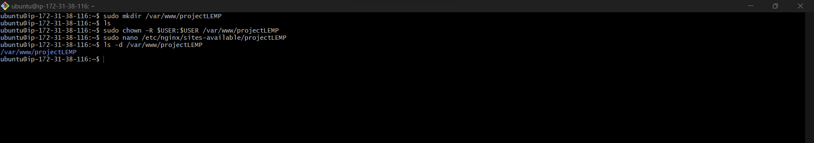

### Then, open a new configuration file, using this command:
>`sudo nano /etc/nginx/sites-available/projectLEMP`

#### This will open a blank file, then we post the following in it:

#/etc/nginx/sites-available/projectLEMP

server {
    listen 80;
    server_name projectLEMP www.projectLEMP;
    root /var/www/projectLEMP;

    index index.html index.htm index.php;

    location / {
        try_files $uri $uri/ =404;
    }

    location ~ \.php$ {
        include snippets/fastcgi-php.conf;
        fastcgi_pass unix:/var/run/php/php8.1-fpm.sock;
     }

    location ~ /\.ht {
        deny all;
    }

}`

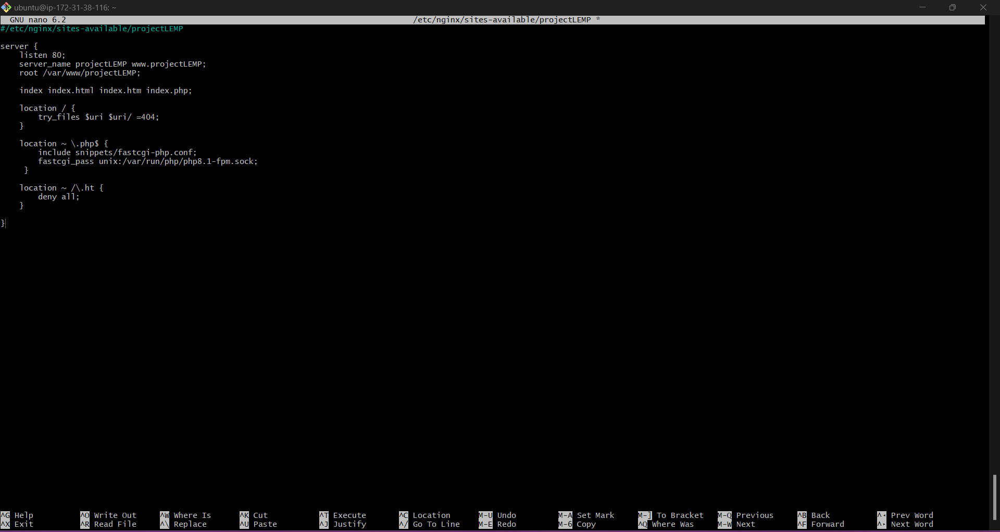
#### click CTRL + X and then Y and Enter, to exit edit mode.
### We activate the configuration by linking to the config file from Nginx’s sites-enabled directory, using this command:
>`sudo ln -s /etc/nginx/sites-available/projectLEMP /etc/nginx/sites-enabled/`
### Then test the configuration using:
>`sudo nginx -t`

### We then disable default Nginx host that is currently configured to listen on port 80, usimg this command:
>` sudo unlink /etc/nginx/sites-enabled/default`

### Then reload Nginx to aplly changes, using this command:
>`sudo systemctl reload nginx`
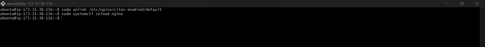

### Next, we create an index.html file in web root location,to test the new server block, using this command:
>`sudo echo 'Hello LEMP from hostname' $(curl -s http://169.254.169.254/latest/meta-data/public-hostname) 'with public IP' $(curl -s http://169.254.169.254/latest/meta-data/public-ipv4) > /var/www/projectLEMP/index.html`

### Now go to your browser and try to open your website URL using IP address:
>`http://<Public-IP-Address>:80`
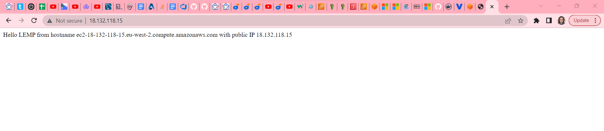
#### If you see the text from ‘echo’ command you wrote to index.html file, then it means your Nginx site is working as expected.

## TESTING PHP WITH NGINX
### Now that LEMP is set up, to validate that Nginx can correctly hand .php files off to your PHP processor, we create a test PHP file in the document root.
#### To do that, open a new file called 'info.php' within the document root, using this command:
>`sudo nano /var/www/projectLEMP/info.php`
### Enter the following lines into the new file:
>`<?php
phpinfo();`

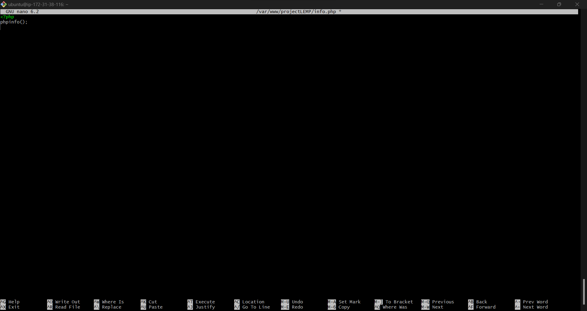
#### Save file then reload the webpage to see the effect
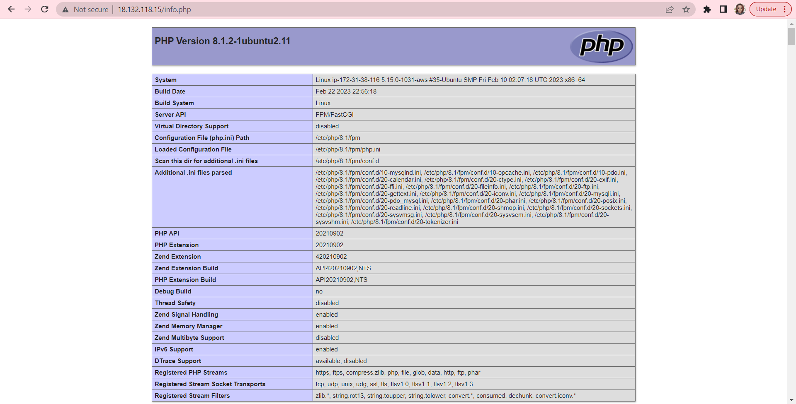

### The remove the file ysing this command:
>`sudo rm /var/www/your_domain/info.php`

## RETRIEVING DATA FROM MYSQL DATABASE WITH PHP
### First, we create a test database (DB) with simple "To do list" and configure access to it.
#### We need to create a new user with the 'mysql_native_password' authentication method in order to be able to connect to the MySQL database from PHP.
#### We start by logging in to the MySQL console with the root account, using this command:
>` sudo mysql -p`
### Then create a new database, using this command:
>`CREATE DATABASE `example_database`;`

### Now we create a new user and grant them full privileges on the database we just created. Using this command:

>`CREATE USER 'example_user'@'%' IDENTIFIED WITH mysql_native_password BY 'password';`

### Next, we give this user permission over the example_database database. Using this command:
>`GRANT ALL ON example_database.* TO 'example_user'@'%';`

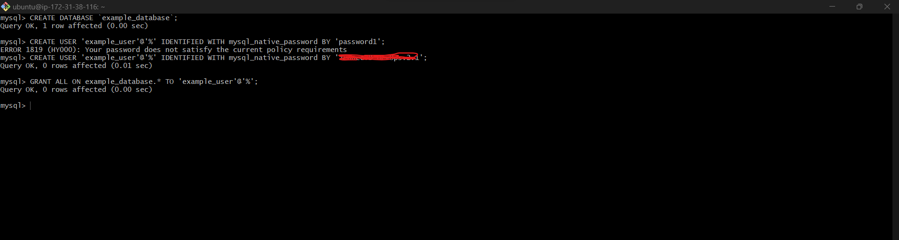

### Exit the MySQL shell with:
>`exit`

### Then login to the console again to test the new user's permissions. Using this command:
>` mysql -u example_user -p`

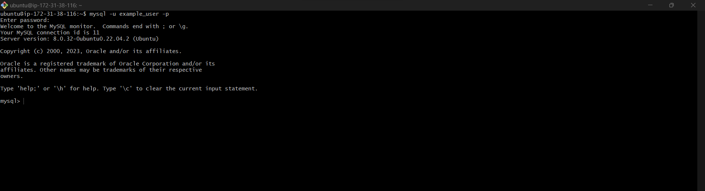
### After logging in, confirm that you have access to the example_database databas, using this command:
>`SHOW DATABASES;`

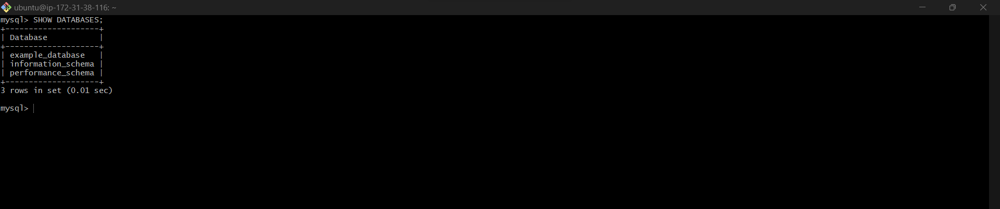

### Next, we’ll create a test table named **todo_list**. Using this command:
>`CREATE TABLE example_database.todo_list (
item_id INT AUTO_INCREMENT,
content VARCHAR(255),
PRIMARY KEY(item_id)
);`
#### Then Insert a few rows of content in the test table, using this command:
>`INSERT INTO example_database.todo_list (content) VALUES ("My first important item");`
#### Run the following code to confirm that the data was successfully saved to your table:
>`confirm that the data was successfully saved to your table`

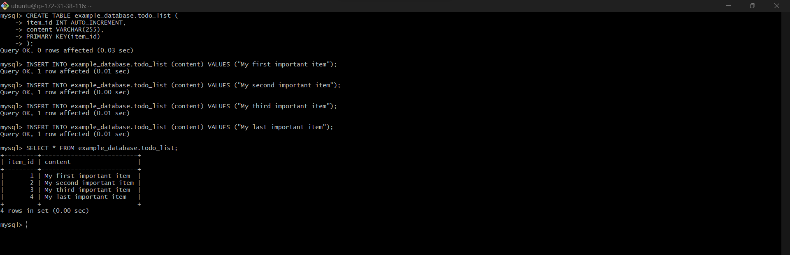

#### Then exit MySQL console with:
>`exit`
### Next, we create a PHP script that will connect to MySQL and query for our content.
#### Create a new PHP file in the custom web root directory, using this command:
>`nano /var/www/projectLEMP/todo_list.php`
#### Then paste this into the *todo_list.php* script:

>`<?php
$user = "example_user";
$password = "password";
$database = "example_database";
$table = "todo_list";
try {
  $db = new PDO("mysql:host=localhost;dbname=$database", $user, $password);
  echo "<h2>TODO</h2><ol>";
  foreach($db->query("SELECT content FROM $table") as $row) {
    echo "<li>" . $row['content'] . "</li>";
  }
  echo "</ol>";
} catch (PDOException $e) {
    print "Error!: " . $e->getMessage() . " ";
    die();
}`
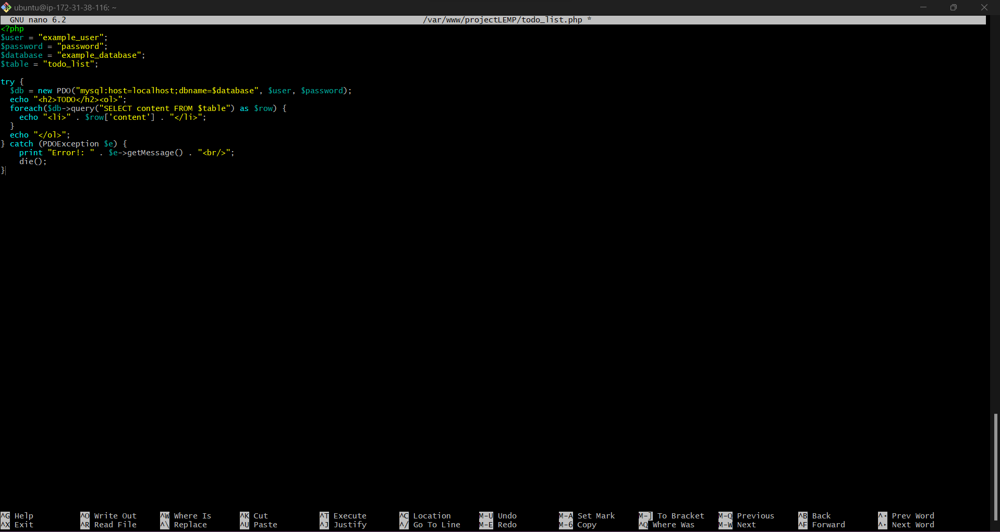
### Save and close editor

### We can now access the page using:
>`http://<Public-IP-Address>/info.php`

#### You should see this:

### **We have built a flexible foundation for serving PHP websites and applications to visitors, using Nginx as web server and MySQL as database management system.**

