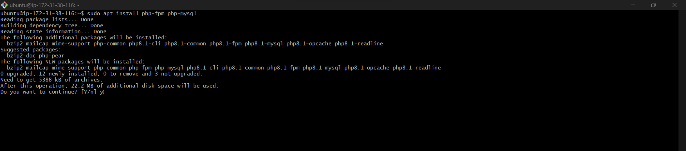

# LEMP STACK IMPLEMENTATION DOCUMENTATION
## First we set up a LEMP STACK using EC2
## We start by creating an account on AWS.

1. Start by creating an instance (virtual machine) by selecting “ubuntu server 20.04 LTS” from Amazon Machine Image(AMI)(free tier).
2. Then select “t2.micro”, go to the security group and select “an existing security group” review and launch instance.

### This launches the instance and takes you to the Instances dashboard

3. Then open a terminal on your system and enter the folder where your previously downloaded PEM file is located.

### In this case we use the Git Bash Terminal

4. Connect to the instance from ubuntu terminal using this command:
>`ssh -i "Jennee-EC2.pem" ubuntu@ec2-18-130-68-79.eu-west-2.compute.amazonaws.com`

### This automatically connects to the instance when you click Enter

## Step 1 – Installing the Nginx Web Server
### Install the Nginx Web Server to display web pages to site visitors.

### We first update the server's package, before we download the nginx web server, using this command:
>`sudo apt update`

### Then install Nginx with this command:
>`sudo apt install nginx`

### Verify that nginx was successfully installed and is running as a service in Ubuntu, using this command:
>`sudo systemctl status nginx`

### If it's green and says "active (running)", then it was successfully installed. Like so:

### Test how our Nginx server can respond to requests from the Internet.
### Open a web browser of your choice and try to access following url:
>`http://<Public-IP-Address>:80`

---
---
## STEP 2 — INSTALLING MYSQL
### We will install a DBMS to be able to store and manage data for the site in a relational database.
### Install MySQL using this command:
>` sudo apt install mysql-server`
#### Type Y and click Enter to continue the download

### When the installation is complete, log in to the MySQL console using this command:
>` sudo mysql`

### This will connect to the MySQL server as the administrative database user root

### Set default password as "PassWord.1" for root user, using this command:
>` ALTER USER 'root'@'localhost' IDENTIFIED WITH mysql_native_password BY 'PassWord.1';`

### Then exit the MySQL shell with this command:
>` mysql> exit`

### Then run this command to start the interactive script:
>` sudo mysql_secure_installation`
### Set secure root password

### Then test if you’re able to log in to the MySQL console using this command:
>`sudo mysql -p`

### Then exit with this command:
>` mysql> exit`

## STEP 3 – INSTALLING PHP

### Install php-fpm and php-mysql using this command:
>` sudo apt install php-fpm php-mysql`
#### Type Y and click Enter to continue with the installation

